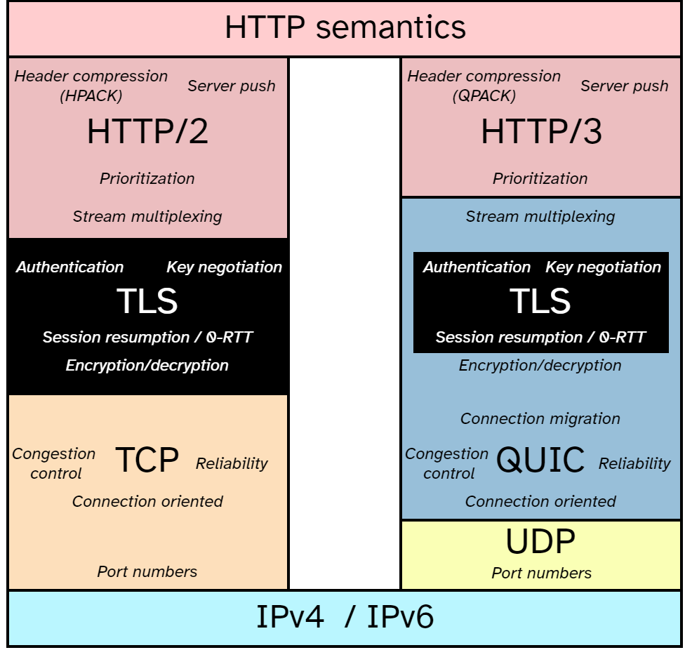
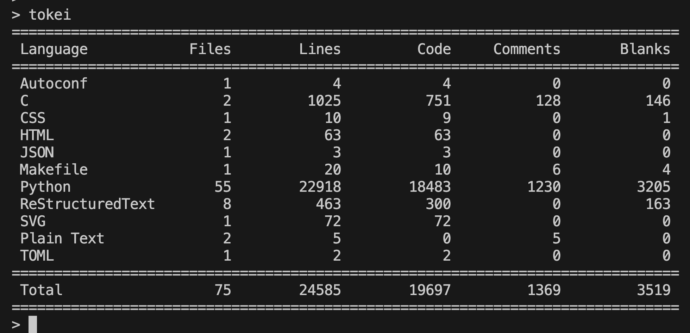
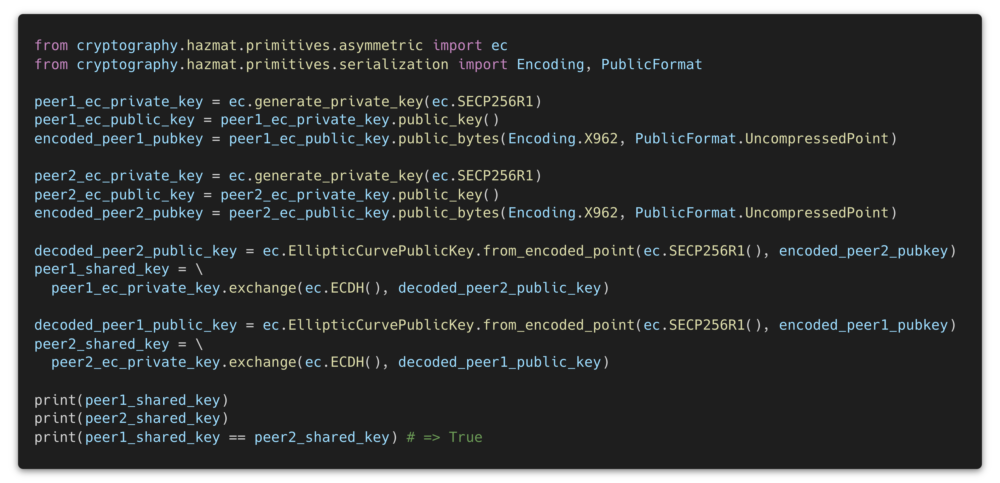
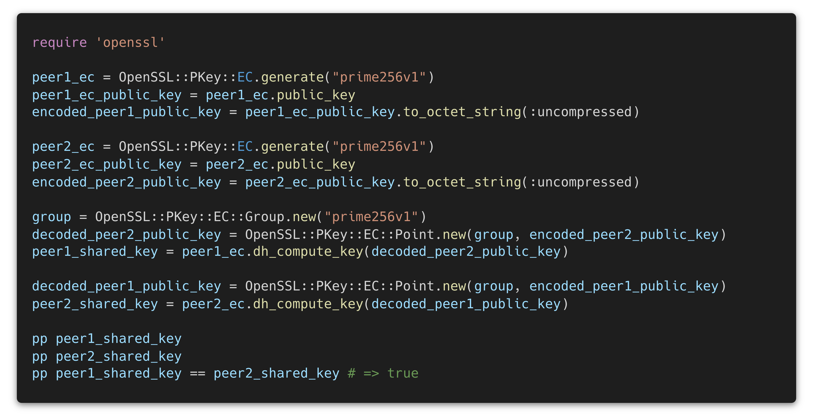
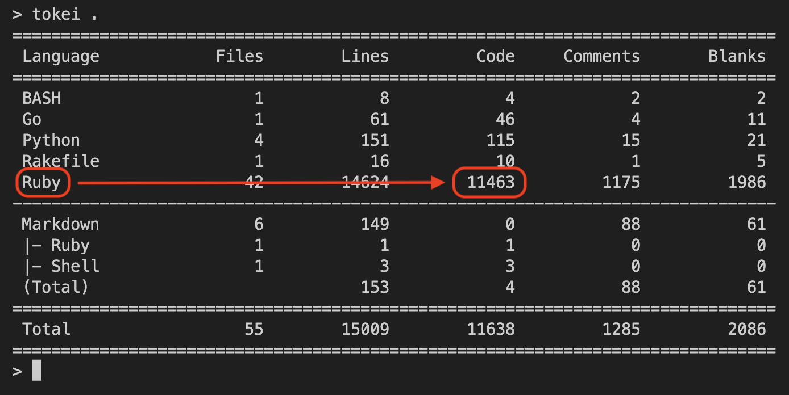
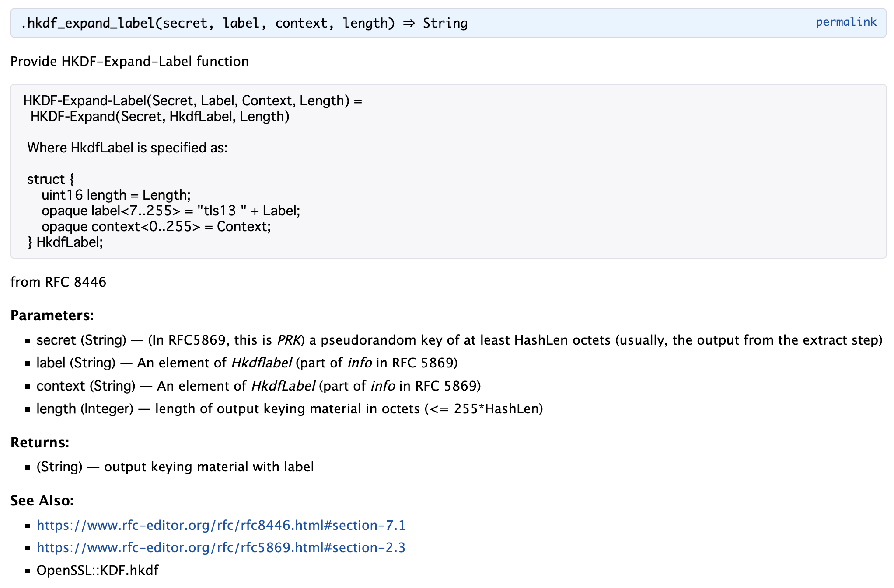

# RubyによるQUICプロトコルの\\n他言語からの移植ならびに\\n独自実装の作成

author
:  unasuke (Yusuke Nakamura)

content-source
:  Ruby Association Activity Report

date
:  2023-08-28

theme
:  theme

# 自己紹介

* Name: unasuke (Yusuke Nakamura)
* Work: フリーランス
* Kaigi on Rails オーガナイザー (10/27-28 開催)
* {::tag name='x-small'}GitHub <https://github.com/unasuke>{:/tag}
* {::tag name='x-small'}ActivityPub <https://mstdn.unasuke.com/@unasuke>{:/tag}
* {::tag name='x-small'}X (Twitter) <https://twitter.com/yu_suke1994>{:/tag}
* {::tag name='x-small'}<https://unasuke.com>{:/tag}

{:relative_width='24' align='right' relative_margin_right='-8' relative_margin_top='35'}


# RubyによるQUICプロトコルの他言語からの移植ならびに独自実装の作成

* 目的1: aioquicをRubyに移植する
* 目的2: 移植の知見からRubyishなQUIC実装を作成する

# QUICとは何か
* RFC 9000を含む複数のRFCによって標準化された通信プロトコル
* UDPの上にTCPのような信頼性のある通信を実現する
* TLSが組み込まれており、セキュアな通信がデフォルトとなっている

# QUICとは何か - Protocol Stack

{:relative_width='45'}

{:.center}
{::tag name='x-small'}image from <https://github.com/rmarx/h3-protocol-stack>{:/tag}

# aioquicとは何か
* <https://github.com/aiortc/aioquic>
* PythonによるQUIC実装
* async/await構文を使用している

# 既存実装
* <https://github.com/quicwg/base-drafts/wiki/Implementations>
  * IETF QUIC WG wikiにおけるQUICの実装一覧
* C, C++, Go, Rust, Haskell, Python, Java等
  * no Ruby

# 移植の動機
* QUICのRuby実装が存在しない
* Ractorの大規模採用例があるとよいのではないか

# そもそも移植は可能なのか

{:relative_width="95"}

{:.center}
aioquicの実装言語比率

# aioquicの依存関係
* <https://pypi.org/project/certifi/> 証明書を提供する
* <https://pypi.org/project/pyOpenSSL/> OpenSSL
  * <https://pypi.org/project/cryptography/>
* <https://pypi.org/project/pylsqpack/> QPACK
  * <https://github.com/litespeedtech/ls-qpack/>

# aioquicの構造

```
$ tree src
src
├── aioquic
│   ├── about.py
│   ├── asyncio
│   │   ├── client.py
│   │   ├── __init__.py
│   │   ├── protocol.py
│   │   └── server.py
│   ├── _buffer.c
│   ├── buffer.py
│   ├── _crypto.c
│   ├── _crypto.pyi
│   ├── quic
│   │   ├── configuration.py
│   │   ├── connection.py
│   │   ├── crypto.py
│   │   ├── events.py
│   │   ├── __init__.py
│   │   ├── logger.py
│   │   ├── packet_builder.py
│   │   ├── packet.py
│   │   ├── rangeset.py
│   │   ├── recovery.py
│   │   ├── retry.py
│   │   └── stream.py
│   └── tls.py
...
```

# buffer.c, buffer.pyi
* C言語によるBuffer領域の実装をPython Objectにしたもの
* mallocした領域に対する操作をPythonから行える
* → StringIOをwrapするClassを作成して移植


# packet.py, packet_builder.py
* Packetそのものを表現したり構築するclass群
* → ほぼそのままClass及びStructに移植

# crypto.py, _crypto.c, _crypto.pyi
* QUICのPacketそのものを暗号化するclass群
* OpenSSLのAPIを利用するC実装も含む
* openssl gem側でのAPIを調査してPure Rubyに移植

# tls.py
* TLS 1.3の(ほぼ)Pure Python実装
  * 鬼門(1800行)
* →ほぼそのまま移植した

# OpenSSL APIの差異
* PythonとRubyでOpenSSL APIをどのように抽象化するかが異なる
* Python側はほぼCと1対1
* Ruby側は扱いやすいように抽象化されている

# OpenSSL APIの差異 Python側

{:relative_width='95'}

# OpenSSL APIの差異 Ruby側

{:relative_width='95'}

# connection.py
* QUICのどのPacketを実際に取り扱う通信部分
  * 鬼門(3200行)
* →ほぼそのまま移植した(テストケース未完走)

# 最終報告時点の成果

{:relative_width='95'}


# 最終報告時点の成果
* <https://github.com/unasuke/raioquic>
  * 11000行
* aioquic, quic-goとの簡単な通信ができることを確認

# やらなかったこと
* connection.rbのテストケース完走
* 実際にリクエストを受け付ける部分の移植
  * asyncioを使用している部分
* Rubyishな実装の作成

# 得られた知見
* PythonとRubyの言語の差
* QUIC及びTLS 1.3に対する理解

# その後の活動
* RubyKaigi 2023登壇
  * <https://rubykaigi.org/2023/presentations/yu_suke1994.html>
* IETF Meetingに参加
  * 116 Yokohama
  * 117 San Francisco (remote)
* Rubyishな実装の作成
  * RubyKaigi 2023 follow up

# Rubyishな実装の作成
* APIをRubyishにする
* Documentationをしっかりやる
* `IO::Buffer` を使用してみる

# Documentationをしっかりやる (HKDF)

{:relative_width="75"}

# `IO::Buffer` を使用してみる

```ruby
# Apply packet protection
# @see https://www.rfc-editor.org/rfc/rfc9001.html#section-5.4
def apply(plain_header, protected_payload)
  packet_number_length = (plain_header.get_value(:U8, 0) & 0x03) + 1
  packet_number_offset = plain_header.size - packet_number_length
  @mask = mask(
    protected_payload.slice(PACKET_NUMBER_LENGTH_MAX - packet_number_length).slice(0, SAMPLE_LENGTH)
  )

  buffer = IO::Buffer.for(plain_header.get_string + protected_payload.get_string).dup # make mutable
  if buffer.get_value(:U8, 0) & 0x80 != 0
    buffer.copy(buffer.slice(0, 1).xor!(IO::Buffer.for((@mask[0].unpack1("C*") & 0x0f).chr)))
  else
    buffer.set_value(:U8, 0, buffer.slice(0, 1).xor!(IO::Buffer.for((@mask[0].unpack1("C*") & 0x1f)).chr))
  end
  buffer.copy(
    buffer.slice(
      packet_number_offset, packet_number_length).xor!(IO::Buffer.for(@mask[1..packet_number_length])
    ),
    packet_number_offset
  )
  buffer
end
```

# まとめ
* 引き続きRubyishなQUIC実装の開発を進めていく
* IETF Meetingに参加して最新動向を追っていく
* 謝辞
  * Ruby Association様
  * 笹田耕一様(メンター)
